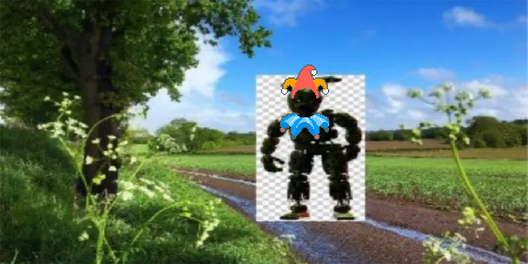

<h1 align="center">Swaglandia Balatro Edition: Jokers n More</h1>

  

This is a Joker replacement for members and references to Swaglandia,
replacing Jokers (and maybe others) with Swaglandia members and/or items 
associated with the server. All card artwork is done by Robely with 
edits and code by MulliganMayhem.

## Key Features
  `-Joker Replacement`
  `-Minor text replacement`
  `-Custom Challenges (8/10 done)`
  `-Card variants for High Contrast consistency`
  `-and more`

## Prerequisites
Other than Balatro itself, the following tools and mods are required:

0. [Lovely (>=0.6)](https://github.com/ethangreen-dev/lovely-injector) (Lua injector, required for Steamodded)
1. [Steamodded (>=1.0.0~alpha)](https://github.com/Steamopollys/Steamodded) (mod loader, required for Malverk)
2. [Malverk (>=1.0)](https://github.com/Eremel/Malverk) (texture pack manager, required for _this_ mod)

If you already have a modded instance of Balatro, you only need to install Malverk!

## Installation
Like any other Steamodded-based Balatro mod, put this mod in the `Mods`
directory in the Balatro `AppData` directory, alongside Steamodded and Malverk.
Either Click the '<>Code' and download as a .zip _or_ download from the
[Releases](https://github.com/MulliganMayhem/SwaglandiaBalatro/releases) page

## Usage
Apply the textures in the Malverk `Textures` menu inside `Options`.
